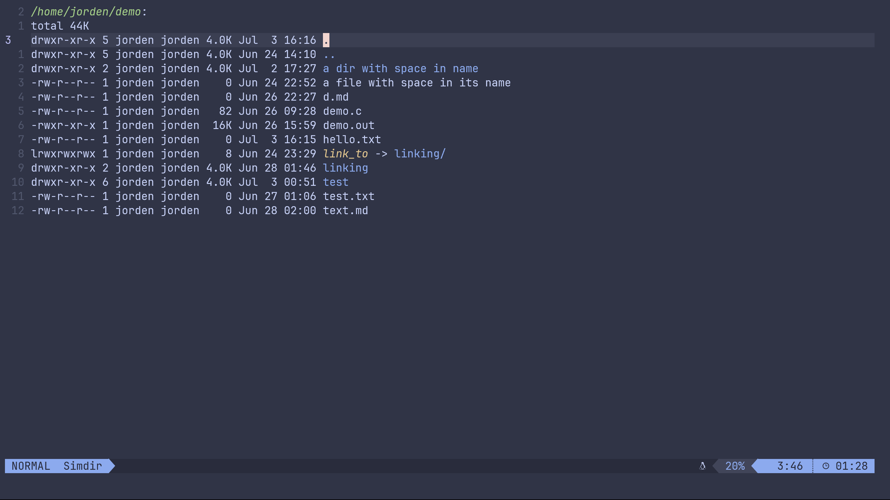

# Simdir.nvim

**Sim**ple **dir**ectory editor is a neovim plugin that shows directory content using dired like format, and provides some basic functions to let you edit your file system.



## Why

Because I'm learning new things by doing :) 

### Caution! This plugin might have a lot of bugs, be careful to use it

### Important! This plugin only works in Unix like system, because it mainly uses `ls` command to generate the content

## Feature

- View your file system in dired like format
- Edit the command in prompt buffer

## Installation & Setup

```lua
return {
    "JordenHuang/simdir.nvim",
    config = function()
        -- The default configuration
        require('simdir').setup({
            default_file_explorer = true,
            use_trash_can_when_remove = true,
            keymaps = {
                ["<CR>"] = "open",
                ["o"] = "open_split",
                ["-"] = "parent_dir",
                ["T"] = "touch",
                ["+"] = "mkdir",
                ["R"] = "rename",
                ["M"] = "move",
                ["C"] = "copy",
                ["m"] = "mark",
                ["d"] = "d_mark",
                ["u"] = "unmark",
                ["U"] = "unmark_all",
                ["i"] = "invert_mark",
                ["X"] = "remove",
                ["r"] = "reload",
                ["s!"] = "shell_command",
            }
        })
    end
}
```

You can setup some keymaps to quick launch the plugin

```lua
local function opts(description)
    return { desc = description, noremap = true, silent = true }
end

-- Set up some keymaps
-- Open last buffer, if no last, ask user to create one or not
vim.api.nvim_set_keymap("n", "<leader>se", ":Simdir open_last<CR>", opts("Simdir: open last buffer"))
vim.api.nvim_set_keymap("n", "<leader>sp", ":Simdir open_parent_dir<CR>", opts("Simdir: open parent directory"))
vim.api.nvim_set_keymap("n", "<leader>so", ":Simdir open_dir<CR>", opts("Simdir: open directory"))
```

## How to use

- Type `Simdir open_parent_dir` in the command mode to open simdir with path set to parent directory

- Type `Simdir open_dir`, then enter the path to open, 
Or type the path after the command, for example `Simdir open_dir ~/projects`

## The prompt buffer

When using the operations in simdir, for example, the `touch` operation

it will open a prompt buffer below the window, with some command pre-written

You need to finish the command in order to perform the command,

or press `<C-c>` (Ctrl+c) in insert mode in the prompt buffer to cancel it

## The operations

Simdir provide `touch`, `mv`, `cp` and `rm` commands to preform the action to the files/directories.

Commands like `mv` `cp` and `rm` can perform on single entry or multiple selection that has mark set on it

The commands like `chmod`, `chown`, `ln`, etc. is not provided, you can use shell command operation to enter the command manually
